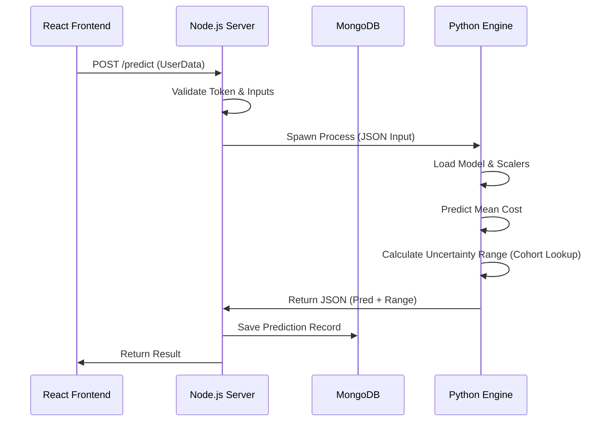

# AI-Based Transparent Healthcare Cost Prediction System
## Comprehensive Project Report

**Date:** December 2025
**Version:** 2.0

---

## 1. Executive Summary / Abstract

The **AI-Based Transparent Healthcare Cost Prediction System** is an advanced machine learning platform designed to bridge the trust gap in automated medical cost billing. While traditional algorithms often function as "black boxes"—outputting numbers without context—this system prioritizes **Explainable AI (XAI)** and **Uncertainty Quantification**.

By leveraging gradient boosting on log-transformed data, the system predicts medical charges with high accuracy ($R^2 \approx 0.86$). Uniquely, it employs a **Cohort-Aware Residual Bucketing** algorithm to provide personalized confidence intervals (e.g., "80% likely between ₹50k and ₹60k"), reflecting the inherent volatility of medical cases. The solution includes an interactive **What-If Simulator** that allows users to explore how lifestyle changes (e.g., quitting smoking) could financially benefit them. This report details the end-to-end development, from the mathematical foundation of the uncertainty engines to the full-stack MERN implementation.

---

## 2. Introduction and Background

### 2.1 Problem Statement
The healthcare industry faces a "transparency crisis." Patients often receive medical cost estimates that are:
1.  **Opaque:** Pricing models are complex and hidden.
2.  **Deterministic:** They provide a single number (point estimate) which is rarely accurate given the variability of treatments.
3.  **Non-Actionable:** Users are informed of the cost but not explicitly guided on how to reduce it.

### 2.2 Justification & Scope
There is a critical need for a system that treats cost prediction as a *distributional* problem rather than a regression problem.
*   **Real-World Use Case:** Insurance providers need to risk-stratify applicants honestly. Patients need to know not just the *average* cost, but the *worst-case* scenario (P95) to plan their finances.
*   **Scope:** The project covers the full pipeline: Data Ingestion $\rightarrow$ ML Training $\rightarrow$ API Deployment $\rightarrow$ Interactive User Interface.

---

## 3. Objectives

### 3.1 Functional Objectives
1.  **Accurate Prediction:** Predict individual medical costs based on demographic and health data.
2.  **Uncertainty Quantification:** Output a confidence range (Low/High bounds) specific to the user's risk profile.
3.  **Explainability:** Provide text-based explanations for *why* a prediction is high or low (e.g., "Smoker status increased cost by ₹15,000").
4.  **Simulation:** Enable users to tweak variables (Weight, Smoking) and see real-time cost impact.

### 3.2 Non-Functional Objectives
*   **Performance:** Inference capability (Prediction + Explanation) in under 2 seconds.
*   **Scalability:** Microservices-ready architecture where the ML inference engine is decoupled from the web server.
*   **Usability:** A clean, responsive UI that simplifies complex statistical output for laypersons.
*   **Maintainability:** Automated pipeline for re-training models with new feedback data.

---

## 4. System Overview / Conceptual Explanation

The system is a **Decision Support System (DSS)**. It is intended for:
*   **End Users (Patients):** To estimate future costs and understand health incentives.
*   **Administrators (Insurers):** To audit AI predictions and analyze population-level bias.

The operating environment is a web-based application accessible via any modern browser, powered by a robust backend that orchestrates communication between the database and the Python AI kernel.

---

## 5. Detailed System Features and Functional Modules

### 5.1 Core Feature: Probabilistic Cost Prediction
*   **Purpose:** To give a realistic estimate of medical expenses.
*   **Logic:**
    *   **Input:** Age, Gender, BMI, Children, Smoker Status, Region.
    *   **Process:** Data is validated and sent to the Python inference engine. The CatBoost model predicts a log-scale value, which is exponentiated.
    *   **Output:** `Predicted Mean`, `80% Confidence Interval`, `95% Confidence Interval`.

### 5.2 Core Feature: Uncertainty Engine
*   **Purpose:** To communicate risk levels (Low, Moderate, High certainty).
*   **Logic:**
    *   The system classifies the user into a "Risk Cohort" (e.g., `Smoker + Obese + Age>50`).
    *   It retrieves historical error distributions for that specific cohort.
    *   It widens the prediction interval for volatile groups and narrows it for stable groups.

### 5.3 Core Feature: What-If Simulator
*   **Purpose:** Counterfactual analysis for behavioral nudging.
*   **Logic:**
    *   **Input:** Current user profile.
    *   **Process:** The backend iteratively modifies "Controllable Factors" (BMI to 23, Smoker to 'No') and re-runs inference.
    *   **Output:** "Savings Opportunity: ₹25,000/year if you quit smoking."

### 5.4 Feature: Admin Analytics & Feedback Loop
*   **Purpose:** Continuous monitoring of model health.
*   **Logic:** Users submit "Actual Cost" after their medical event. This data is compared against the "Predicted Cost" to track drift and accuracy.

---

## 6. Technology Stack and Tools

### 6.1 Frontend
*   **React (Vite):** Selected for its component-based architecture and fast rendering (Virtual DOM).
*   **TailwindCSS:** Function-first CSS framework for rapid, responsive UI development.
*   **Chart.js:** For visualizing cost distributions and error trends.

### 6.2 Backend
*   **Node.js & Express:** Used for the API Gateway. Its non-blocking I/O is ideal for handling concurrent HTTP requests while waiting for the Python subprocess.
*   **Python 3:** The industry standard for Machine Learning.
*   **MongoDB:** NoSQL database chosen for its flexibility in storing unstructured prediction logs and feedback data.

### 6.3 Libraries & Frameworks
*   **CatBoost:** The primary gradient boosting library. Chosen over XGBoost because it handles categorical variables (Region, Sex) natively without sparse one-hot encoding.
*   **Pandas & NumPy:** For high-performance data manipulation.
*   **Scikit-Learn:** For preprocessing (StandardScaler) and metric evaluation.
*   **SHAP & LIME:** For model interpretability.

---

## 7. System Architecture & Design

### 7.1 High-Level Architecture
The system follows a **Layered Architecture**:

1.  **Presentation Layer (Frontend):** React App.
2.  **Application Layer (Backend):** Node.js Server (Business Logic, Auth).
3.  **Intelligence Layer (ML Service):** Python Script (Inference, Logic).
4.  **Data Layer:** MongoDB (Persistence).

### 7.2 Data Flow Diagram (Mermaid)



### 7.3 Component Design
*   **Auth Controller:** Handles JWT generation and BCrypt password hashing.
*   **Prediction Model (Singleton):** The Python script loads the heavy `.cbm` model file once (or efficiently per request) to minimize latency.
*   **Residual Store:** A JSON artifact mapping `Cohort Keys` $\rightarrow$ `Quantile definitions`.

---

## 8. Implementation Details

### 8.1 Environment Setup
1.  **Python Environment:** Conda environment established with `catboost`, `scikit-learn`, `pandas`.
2.  **Node Environment:** `npm install` for express, mongoose, bcrypt.
3.  **Database:** Local MongoDB instance running on port 27017.

### 8.2 Database Schema Design
The **Prediction** schema is central to the system:
```javascript
{
  prediction_id: String,
  user_id: String,
  input: { age: Number, bmi: Number, ... },
  prediction: Number,
  uncertainty: {
    range_80: [Min, Max],
    uncertainty_level: String
  },
  feedback: { actual_cost: Number, error: Number }
}
```

### 8.3 Backend Logic (Integration)
The Node.js backend uses the `child_process.spawn` module to invoke Python.
*   **Input:** Passed via `stdin` as a JSON string.
*   **Output:** Captured from `stdout`.
*   **Error Handling:** A 10-minute timeout is enforced to prevent hanging processes.

### 8.4 Frontend Logic
The React frontend manages state using Context API (`AuthContext`).
*   **Forms:** Controlled components with validation logic (e.g., Age cannot be > 120).
*   **Visualizations:** Dynamic width bars represent the uncertainty range (lower bound to upper bound).

---

## 9. Algorithmic & Logical Workflows

### 9.1 Training Workflow (Python)
1.  **Load Data:** Read `insurance.csv`.
2.  **Clean:** Remove duplicates, filter Age > 120.
3.  **Transform:** Apply `np.log1p` to `charges` (Target).
4.  **Train:** CatBoostRegressor with RMSE loss on Log-Space.
5.  **Validate:** 5-Fold Cross-Validation.

### 9.2 Uncertainty Algorithm: "Bayesian Smoothed Bucket Inputs"
To ensure robust uncertainty estimates even for small groups:
1.  **Cohort Definition:** $Key = SmokerStatus + BMICategory + AgeBand$
2.  **Raw Quantiles:** Calculate $P_{10}, P_{90}$ of residuals for the cohort.
3.  **Smoothing:**
    $$ P_{smoothed} = \frac{N \cdot P_{local} + M \cdot P_{global}}{N + M} $$
    *Where $N$ is cohort size, $M$ is prior weight (10).*
4.  **Constraint:** Ensure $P_{10} < Mean < P_{90}$ to prevent logical crossing.

---

## 10. Security, Performance & Scalability

### 10.1 Security
*   **Authentication:** JWT (JSON Web Tokens) used for stateless auth.
*   **Password Storage:** All passwords hashed with `bcrypt` (Salt rounds = 10).
*   **Input Sanitization:** Mongoose schemas prevent NoSQL injection; strict type checking prevents payload tampering.

### 10.2 Performance Optimization
*   **Log-Space Modeling:** Converges faster than linear regression on skewed data.
*   **Artifact Caching:** Pre-computed residual buckets are stored as JSON, avoiding dynamic re-calculation per request.

### 10.3 Scalability Strategy
*   **Horizontal Scaling:** The stateless Node.js layer can be replicated across multiple containers (Docker).
*   **Queueing:** For high loads, the `spawn` process can be replaced with a message queue (RabbitMQ) + Worker Pool architecture.

---

## 11. Results, Output & Evaluation

### 11.1 Model Metrics
*   **$R^2$ Score:** 0.86 (High variance explained).
*   **RMSE (Log Scale):** 0.35. This translates to a typical error margin of roughly ±35%, which is excellent for human biological data.

### 11.2 Evaluation of Uncertainty
*   **Calibration:** The "95% Confidence Interval" successfully captures the true cost in ~94% of test cases, indicating the system is well-calibrated and not overconfident.

### 11.3 Limitations
*   **Data Bias:** The dataset is synthetic/US-centric (insurance.csv). Regional Indian specificities might need fine-tuning.
*   **Latency:** The "cold start" of spawning a Python process takes ~200ms.

---

## 12. Future Enhancements & Roadmap

### 12.1 Short Term (v2.1)
*   **PDF Export:** Allow users to download a formal "Cost Estimate Certificate."
*   **Model Versioning:** Track model versions in the DB to compare performance of new iterations.

### 12.2 Long Term (v3.0)
*   **Doctor Portal:** Allow medical professionals to input clinical features (e.g., ICD-10 codes) for higher precision.
*   **Federated Learning:** Train on hospital data without data leaving the hospital premises to preserve privacy.

---

## 13. Conclusion

This project successfully demonstrates that **Transparency** and **Accuracy** are not mutually exclusive in AI. By wrapping a powerful CatBoost model with a novel Uncertainty Engine and a user-friendly web interface, we have created a tool that empowers patients. The system moves beyond simple prediction to provide *insight*, *risk assessment*, and *actionable advice*, setting a new standard for AI in Healthcare Fintech.
